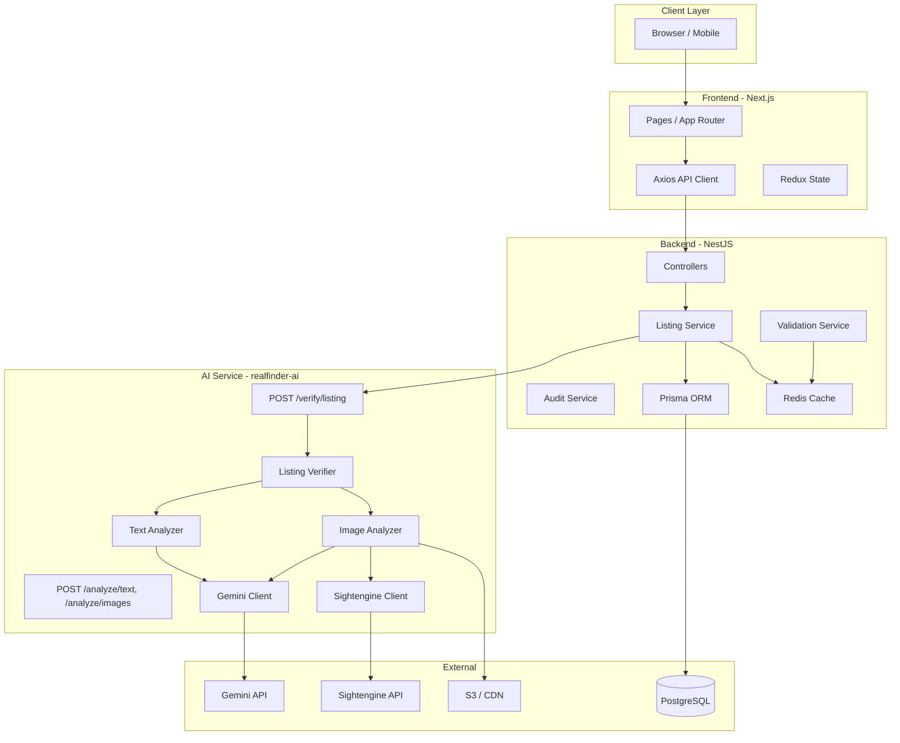
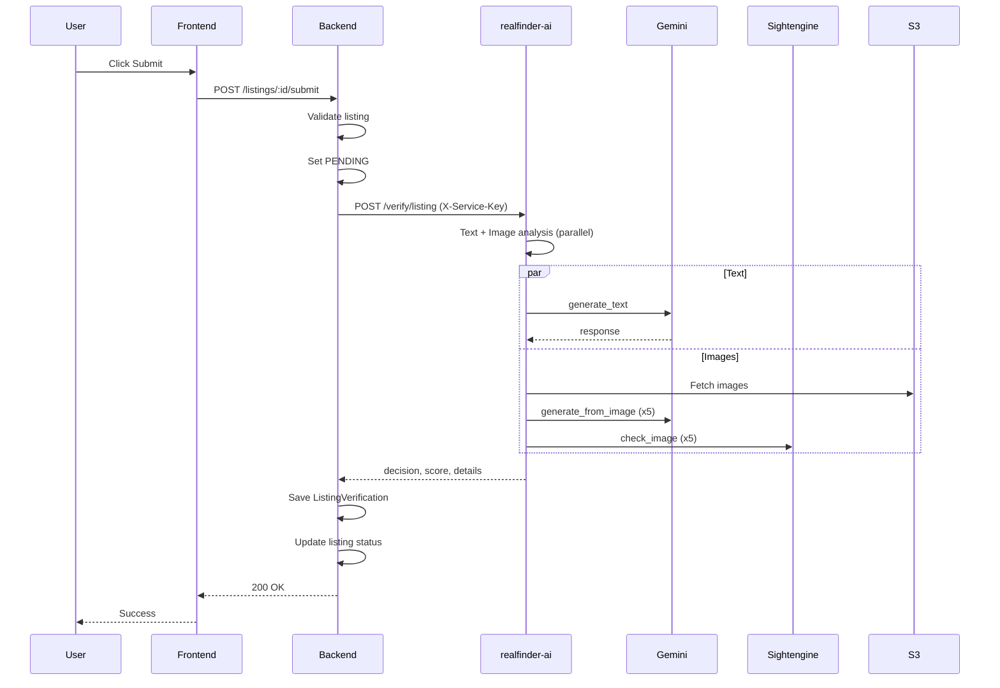

# RealFinder AI Scalability Audit

> **Author**: AI Audit  
> **Created**: 2026-02-19  
> **Scope**: realfinder-ai, backend (NestJS), frontend (Next.js)  
> **Focus**: Scalability, Performance, Best Practices, Redundancy

---

## 1. Executive Summary

This document provides a detailed scalability audit of the RealFinder platform, covering the AI microservice (realfinder-ai), NestJS backend, and Next.js frontend. It identifies current gaps and outlines concrete changes to support future growth as the platform integrates AI verification (TL1/TL2/TL3) and scales listing volume.

**Audience**: Backend, AI, and Frontend teams planning future integrations.

---

## 2. System Architecture Overview



---

## 3. RealFinder AI Service (realfinder-ai) — Scalability Audit

### 3.1 Current State

| Aspect | Implementation | Scalability Rating |
|--------|----------------|--------------------|
| Process model | Single Uvicorn worker | Low |
| Statelessness | Fully stateless (no DB) | High |
| Concurrency | asyncio, Semaphore(3) per image batch | Medium |
| HTTP clients | New `httpx.AsyncClient` per URL check | Low |
| Request limits | No Pydantic `max_length` on payloads | Low |
| Global rate limit | None (per-request semaphore only) | Low |
| Caching | None | Low |
| Retry logic | None | Low |
| Circuit breaker | None | Low |

### 3.2 Detailed Scalability Findings

#### 3.2.1 Process & Worker Model

**Current**: Docker CMD runs `uvicorn app.main:app --host 0.0.0.0 --port 8000` with default single worker.

**Impact**:
- One process handles all requests
- CPU-bound work (JSON parsing, prompt building) and I/O (Gemini, Sightengine) contend on the same event loop
- Under load, request latency increases and throughput plateaus

**Recommendation**:
```dockerfile
# docker/Dockerfile - CMD
CMD ["uvicorn", "app.main:app", "--host", "0.0.0.0", "--port", "8000", "--workers", "2"]
```
- Use `--workers` based on CPU cores: `min(2, os.cpu_count())` or env `UVICORN_WORKERS`
- At 2–4 workers, each process has its own event loop and Gemini/Sightengine clients
- Consider `--limit-concurrency` if you want to cap total concurrent requests per instance

**Files to modify**:
- [realfinder-ai/docker/Dockerfile](realfinder-ai/docker/Dockerfile) — add `--workers`
- [realfinder-ai/app/config.py](realfinder-ai/app/config.py) — add `uvicorn_workers: int = 1`

---

#### 3.2.2 HTTP Client Reuse (Image URL Validation)

**Current**: In `image_analyzer.py`, `_check_urls` creates a new `httpx.AsyncClient` per URL:

```python
async def check_one(url: str) -> tuple[str, bool]:
    async with httpx.AsyncClient(timeout=IMAGE_FETCH_TIMEOUT) as client:
        resp = await client.head(url)
        return (url, resp.is_success)
```

**Impact**:
- Connection churn: new client per URL, no connection pooling
- With 5 URLs per listing, each request creates 5 clients
- At 100 listings/hour → 500 client creations/hour
- Slower response times and higher resource usage

**Recommendation**:
- Reuse a shared `httpx.AsyncClient` for URL checks
- Options:
  1. Inject from app state (create in lifespan, pass via dependency)
  2. Use the existing Gemini client's `_http` for image fetch (already used for `_fetch_image`)
- Connection pooling will reduce latency and resource usage

**Files to modify**:
- [realfinder-ai/app/services/image_analyzer.py](realfinder-ai/app/services/image_analyzer.py) — reuse client in `_check_urls`
- [realfinder-ai/app/main.py](realfinder-ai/app/main.py) — optionally add shared `httpx.AsyncClient` in lifespan

---

#### 3.2.3 Request Payload Limits

**Current**: Schemas in `verification.py` have no `max_length`:

```python
image_urls: list[str] = Field(...)  # unbounded
description: str | None = Field(default=None)  # unbounded
attributes: dict[str, str] | None = Field(default=None)  # unbounded
```

**Impact**:
- Malicious or buggy clients can send huge payloads (e.g. 10,000 image URLs)
- Memory exhaustion, slow parsing, Gemini API overload
- DoS vector

**Recommendation**:
```python
image_urls: list[str] = Field(..., max_length=20)
description: str | None = Field(default=None, max_length=50_000)
attributes: dict[str, str] | None = Field(default=None, max_length=100)
```

**Files to modify**:
- [realfinder-ai/app/schemas/verification.py](realfinder-ai/app/schemas/verification.py)

---

#### 3.2.4 Global Rate Limiting

**Current**: Semaphore limits concurrency *within* a single request (3 concurrent Gemini calls per image batch). There is no global cap across requests.

**Impact**:
- 10 concurrent listing submissions → each can trigger 5 images × (Gemini + Sightengine) → 10 × 5 × 2 = 100 concurrent external API calls
- Gemini free tier: 60 req/min → quick 429s
- Even paid tier can be overwhelmed

**Recommendation**:
- Add a global semaphore or token bucket at app level
- Limit total concurrent AI requests (e.g. 10–20 per instance)
- Return 503 or queue when limit exceeded; NestJS can retry or queue for manual review
- Consider `slowapi` or custom middleware for rate limiting

**Files to add/modify**:
- New `app/core/rate_limiter.py` — global semaphore
- [realfinder-ai/app/dependencies.py](realfinder-ai/app/dependencies.py) — inject into verification routes
- [realfinder-ai/app/config.py](realfinder-ai/app/config.py) — `max_concurrent_ai_requests: int = 20`

---

#### 3.2.5 Caching

**Current**: No caching. Same listing re-verified hits Gemini and Sightengine again.

**Impact**:
- Duplicate submissions, retries, or admin re-checks all incur full AI cost
- Unnecessary latency and external API usage

**Recommendation** (future):
- Optional Redis/in-memory cache: key `listing:{id}:hash(request)` → TTL 5–15 min
- Only cache APPROVE/REJECT results; FLAG should re-run
- Backend can pass `X-Request-Id` or `listing_id` for cache key

---

#### 3.2.6 Retry & Circuit Breaker

**Current**: No retries on Gemini, Sightengine, or image fetch. No circuit breaker.

**Impact**:
- Transient 5xx or network blips cause immediate failure
- Repeated calls to an unhealthy external service waste resources and increase latency

**Recommendation**:
- Add `tenacity` (or similar) for retries: 3 attempts, exponential backoff, retry on 429/5xx/timeout
- Add simple circuit breaker (e.g. `pybreaker`) around Gemini and Sightengine: open after 5 consecutive failures, half-open after 60s

**Files to add/modify**:
- [realfinder-ai/requirements.txt](realfinder-ai/requirements.txt) — add `tenacity`
- [realfinder-ai/app/services/gemini_client.py](realfinder-ai/app/services/gemini_client.py) — wrap `_call` with retry
- [realfinder-ai/app/services/sightengine_client.py](realfinder-ai/app/services/sightengine_client.py) — same
- New `app/core/circuit_breaker.py` (optional)

---

### 3.3 Scalability Summary — realfinder-ai

| Priority | Change | Effort | Impact |
|----------|--------|--------|--------|
| High | Reuse httpx client in `_check_urls` | Low | Medium |
| High | Add Pydantic `max_length` on payloads | Low | High |
| High | Add retry with backoff for Gemini/Sightengine | Medium | High |
| Medium | Add `--workers` to Uvicorn | Low | High |
| Medium | Global rate limit / semaphore | Medium | High |
| Medium | Circuit breaker for external APIs | Medium | Medium |
| Low | Optional response cache (Redis) | High | Medium |

---

## 4. Backend (NestJS) — Scalability Audit for AI Integration

### 4.1 Current State

| Aspect | Implementation | Scalability Rating |
|--------|----------------|--------------------|
| AI service integration | Not yet implemented | N/A |
| HTTP client for AI | N/A | N/A |
| Body parser limit | 15MB (configurable) | Good |
| Redis cache | KeyvRedis, TTL 1h | Good |
| DB connection pool | Prisma default | Good |
| Event hooks | Fire-and-forget | Good |

### 4.2 Future Integration Points (TL1)

When `submitForApproval` integrates with realfinder-ai:

1. **Listing Service** calls AI service after validation, before/after status change
2. **Request flow**: Load listing → Build payload → POST to AI → Save results → Update status

### 4.3 Scalability Recommendations for Backend

#### 4.3.1 AI Service HTTP Client

**Requirements**:
- Use `HttpService` (axios) or `fetch` with:
  - Timeout: 30–45 seconds (image analysis can take 5–10s)
  - Retry: 2–3 attempts with exponential backoff on 5xx/timeout
  - Circuit breaker: stop calling AI after N failures, resume after cooldown
- Connection pooling: reuse connections (default with axios)

**Suggested config**:
```typescript
// validation.config.ts or new ai-service.config.ts
AI_SERVICE_URL: process.env.AI_SERVICE_URL || 'http://localhost:8000'
AI_SERVICE_TIMEOUT_MS: 45000
AI_SERVICE_RETRY_ATTEMPTS: 2
AI_SERVICE_CIRCUIT_BREAKER_THRESHOLD: 5
AI_SERVICE_CIRCUIT_BREAKER_COOLDOWN_MS: 60000
```

**Files to add**:
- `backend/src/config/ai-service.config.ts`
- `backend/src/infrastructure/ai/ai-service.client.ts` — HTTP client with retry + circuit breaker
- `backend/src/modules/listing/ai-verification.service.ts` — orchestration

---

#### 4.3.2 Non-Blocking AI Call

**Current** (planned): `submitForApproval` will likely call AI synchronously.

**Options**:

| Option | Pros | Cons |
|--------|------|------|
| **Sync call** | Simple, immediate result | Blocks HTTP request 5–15s; timeout risk |
| **Async + webhook** | Non-blocking; backend can process later | More complex; need webhook endpoint |
| **Async + polling** | Frontend polls for result | Extra round-trips; more moving parts |

**Recommendation for MVP**:
- Use **sync call** with 30–45s timeout
- Frontend shows loading state; user expects 5–15s for "verifying..."
- If AI times out or fails: set listing to PENDING, queue for manual review (graceful degradation)
- For higher scale (e.g. 1000+ listings/day): consider queue (Redis/Bull) + worker + webhook

---

#### 4.3.3 Database Considerations

**ListingVerification** writes:
- One row per check type (TEXT_ANALYSIS, IMAGE_ANALYSIS) per listing
- Indexes on `listingId`, `checkType`, `status` — already present

**Scalability**:
- Writes are append-heavy; read load for admin dashboard
- Consider read replicas for admin queries if dashboard grows
- Connection pooling: Prisma default; tune `datasource` if needed

---

#### 4.3.4 Redis Usage

**Current**: Validation service caches country/language; other caches exist.

**Future**:
- Optional: cache AI result by `listing_id` + hash for short TTL (e.g. 10 min) to avoid duplicate AI calls on retries
- Circuit breaker state: can be in-memory per instance or in Redis for multi-instance consistency

---

### 4.4 Scalability Summary — Backend

| Priority | Change | Effort | Impact |
|----------|--------|--------|--------|
| High | Add AI service HTTP client with timeout + retry | Medium | High |
| High | Add circuit breaker for AI service | Medium | High |
| Medium | Config for AI_SERVICE_* env vars | Low | Medium |
| Medium | Graceful degradation when AI unavailable | Low | High |
| Low | Optional Redis cache for AI results | Medium | Medium |
| Future | Queue-based async verification | High | High (at scale) |

---

## 5. Frontend (Next.js) — Scalability Audit for AI Integration

### 5.1 Current State

| Aspect | Implementation | Scalability Rating |
|--------|----------------|--------------------|
| API client | Axios, single instance | Good |
| Request timeout | Default (no explicit) | Medium |
| Error handling | 401 clears auth; other errors propagate | Medium |
| Loading states | Per-component | Good |
| Retry logic | None on client | Low |

### 5.2 Future Integration Points

When listing verification uses AI:

1. **Submit for approval**: User clicks "Submit" → POST to backend → Backend calls AI → Response 5–15s later
2. **Action items / admin**: Fetch flagged listings; may need pagination
3. **Listing detail**: Show verification status, confidence score

### 5.3 Scalability Recommendations for Frontend

#### 5.3.1 Request Timeout for Verification

**Current**: Axios default timeout is none (browser may have its own).

**Recommendation**:
- Set timeout for long-running calls (e.g. submit for approval):
  ```typescript
  api.post(`/listings/${id}/submit`, {}, { timeout: 60000 }); // 60s
  ```
- Show clear loading state: "Verifying listing… This may take up to 30 seconds."
- On timeout: show "Verification is taking longer than expected. Your listing has been submitted and will be reviewed shortly." (matches backend fallback to PENDING)

---

#### 5.3.2 Optimistic Updates & Polling (Optional)

**Option A**: Wait for full response (simplest)
- Disable submit button, show spinner
- On 200: show success, redirect or refresh
- On timeout/error: show message, listing is PENDING

**Option B**: Optimistic + polling (smoother UX)
- Immediately show "Submitted, verifying…"
- Poll `GET /listings/:id` for `verificationStatus` every 2–3s, max 30s
- When VERIFIED/FLAGGED/REJECTED: update UI
- Requires backend to process AI asynchronously (queue) — future enhancement

**Recommendation for MVP**: Option A.

---

#### 5.3.3 Pagination & Infinite Scroll

For admin action items (flagged listings):
- Ensure backend supports cursor/offset pagination
- Frontend: use infinite scroll or "Load more" to avoid loading thousands of rows at once

---

#### 5.3.4 Client-Side Caching

- Consider React Query or SWR for listings, action items, verification status
- Reduces duplicate requests when navigating back/forth
- Stale-while-revalidate improves perceived performance

---

### 5.5 Scalability Summary — Frontend

| Priority | Change | Effort | Impact |
|----------|--------|--------|--------|
| High | Timeout (60s) for submit-for-approval | Low | Medium |
| High | Loading state for verification (15–30s) | Low | High |
| Medium | Clear error message on timeout | Low | Medium |
| Low | React Query / SWR for listing data | Medium | Medium |
| Future | Polling for async verification status | Medium | Medium |

---

## 6. Cross-Component Data Flow & Bottlenecks

### 6.1 TL1 Listing Verification Flow (Future)



### 6.2 Identified Bottlenecks

| Step | Bottleneck | Mitigation |
|------|------------|------------|
| B → AI | No timeout/retry | Backend: 45s timeout, 2 retries, circuit breaker |
| AI → Gemini | No retry, no global limit | realfinder-ai: retry, global semaphore |
| AI → Sightengine | No retry | realfinder-ai: retry with tenacity |
| AI `_check_urls` | New client per URL | Reuse httpx client |
| Frontend | No timeout, poor loading UX | 60s timeout, "Verifying… up to 30s" message |

---

## 7. Deployment & Infrastructure

### 7.1 Current Docker Setup

- **Backend**: Single container, no replica count in docker-compose
- **realfinder-ai**: Not in main docker-compose; runs separately
- **Postgres**: Single instance
- **Redis**: Single instance

### 7.2 Scaling Strategy

| Component | Horizontal Scaling | Notes |
|-----------|--------------------|-------|
| realfinder-ai | Add replicas behind LB | Stateless; scale independently |
| Backend | Add replicas behind LB | Stateless (session in Redis) |
| Postgres | Read replicas | For search, admin queries |
| Redis | Single or cluster | Cache + rate limit state |
| Frontend | CDN + static export or SSR | Next.js scales via Vercel/k8s |

### 7.3 Recommended docker-compose Additions

```yaml
# When integrating AI
ai-service:
  build: ../realfinder-ai
  ports: ["8000:8000"]
  env_file: [.env]
  deploy:
    replicas: 2  # or use docker-compose scale
```

---

## 8. Metrics & Observability (Future)

To support scalability decisions:

| Metric | Source | Use |
|--------|--------|-----|
| AI request latency p50/p95 | realfinder-ai | Detect slow Gemini/Sightengine |
| AI error rate | realfinder-ai | Circuit breaker, alerts |
| Backend → AI timeout rate | Backend | Tune timeout, consider async |
| Verification throughput | Backend | Plan queue/workers |
| Manual review queue size | Backend | Admin capacity planning |

---

## 9. Implementation Roadmap

### Phase 1 — MVP (Pre-TL1 Integration)

- [ ] realfinder-ai: Reuse httpx client in `_check_urls`
- [ ] realfinder-ai: Add `max_length` to Pydantic schemas
- [ ] realfinder-ai: Add retry (tenacity) for Gemini and Sightengine
- [ ] realfinder-ai: Add `--workers` to Uvicorn in Dockerfile

### Phase 2 — TL1 Integration

- [ ] Backend: AI service HTTP client with timeout, retry, circuit breaker
- [ ] Backend: Call realfinder-ai from `submitForApproval`; graceful degradation
- [ ] Frontend: 60s timeout and loading state for submit
- [ ] Add realfinder-ai to docker-compose

### Phase 3 — Scale Hardening

- [ ] realfinder-ai: Global rate limit / semaphore
- [ ] realfinder-ai: Circuit breaker for external APIs
- [ ] Backend: Optional Redis cache for AI results
- [ ] Observability: Logging, metrics, alerts

### Phase 4 — Higher Scale (1000+ listings/day)

- [ ] Backend: Queue-based async verification (Bull + Redis)
- [ ] Backend: Webhook for AI result
- [ ] Frontend: Polling for verification status
- [ ] Infrastructure: Multiple AI service replicas, load balancer

---

## 10. References

- [Architecture AI Verification](architecture-ai-verification.md)
- [TL1 Implementation Plan](TL1-implementation-plan.md)
- [realfinder-ai README](../../realfinder-ai/README.md)
- Backend: `backend/src/modules/listing/listing.service.ts` — `submitForApproval`
- Backend: `backend/docker-compose.yml`
- Frontend: `frontend/src/services/api.ts`
